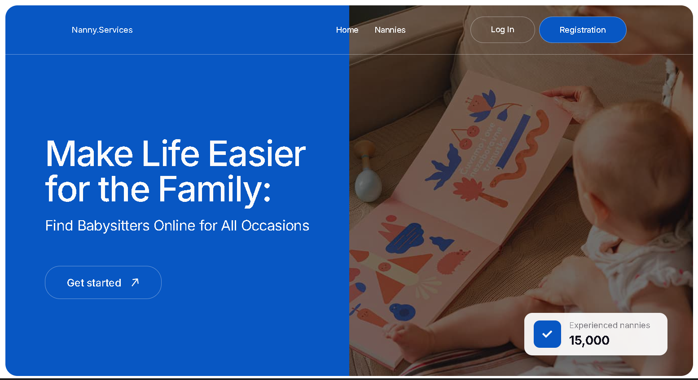
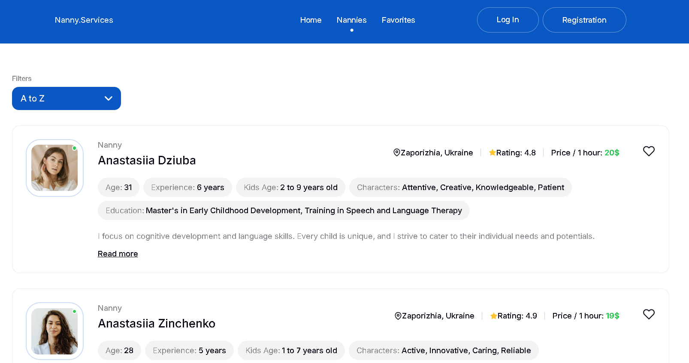
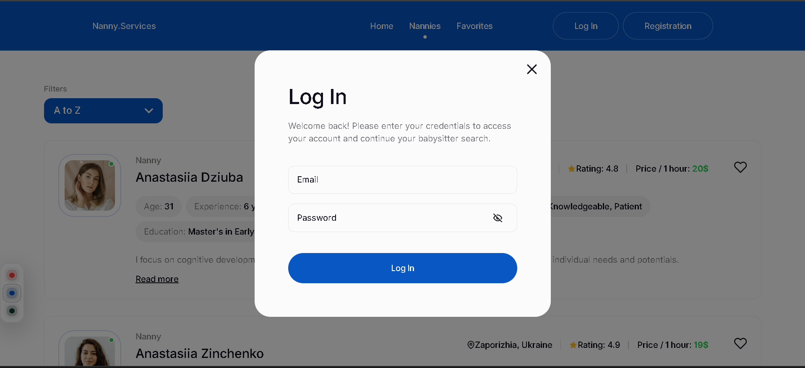
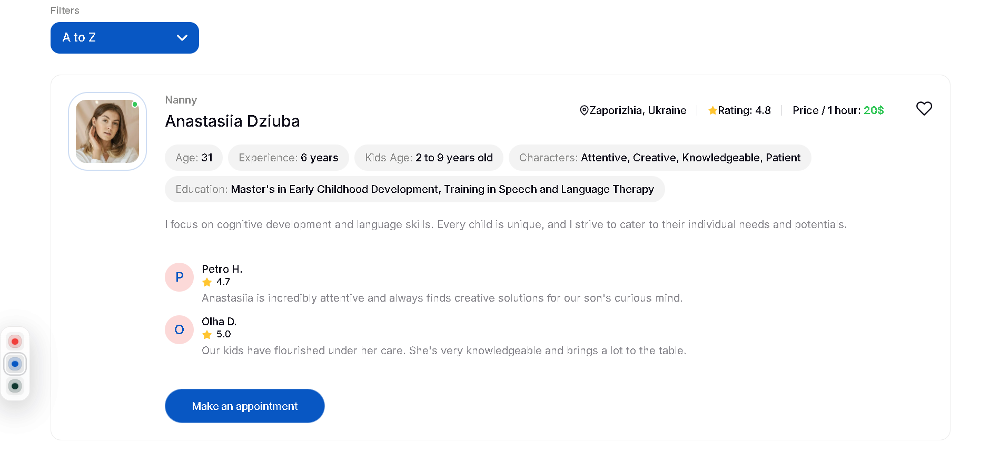

# Nanny.Services — Babysitter Marketplace (React + Vite)

A babysitter catalog with authentication, protected favorites, and appointment booking via modal forms.
Routing is handled with React Router. Forms use react-hook-form + Yup validation. UI includes reusable modal and error components (page / inline), animations via Framer Motion, and styling via CSS Modules.

This is a React project bootstrapped with Vite.

## Tech stack:

<li> React,
<li> TypeScript,
<li> Vite,
<li> React Router — routing, protected pages, 404 fallback,
<li> react-hook-form — form state + performance,
<li> Yup + @hookform/resolvers — schema validation,
<li> Framer Motion — UI animations,
<li> CSS Modules — component styles.

## Features:

<li>Nannies catalog page;
<li>Favorites page доступна лише авторизованим користувачам (ProtectedRoute);
<li>Modal windows: Login, Registration, Appointment;
<li>Validated forms (loginSchema / registerSchema / appointmentSchema);
<li>Appointment form includes custom TimePicker (Controller integration);
<li>ErrorView supports page mode (404) and inline mode (form errors);
<li>Responsive layout and clean UI components.

## Getting Started

First, install dependencies:

```bash
npm i
# or
yarn
# or
pnpm i
# or
bun install
```

Environment variables

Configure your environment variables:

```bash
cp .env.example .env
# Fill in: BASE_URL, etc.
```

Then, run the development server:

```bash
npm run dev
# or
yarn dev
# or
pnpm dev
# or
bun dev
```

Open [http://localhost:5173](http://localhost:5173) with your browser to see the result.

To build the project:

```bash
npm run build
```

To preview the production build locally:

```bash
npm run preview
```

## Project Structure

Key folders and files:

<li>src/routes/AppRoutes.tsx — routes (/, /nannies, /favorites, 404)
<li>src/pages — HomePage, Nannies, Favorites
<li>src/components — Modal, LoginForm, RegisterForm, AppointmentForm, TimePicker, ErrorView, ProtectedRoute
<li>src/schemas — loginSchema, registerSchema, appointmentSchema

## Routing

Routes:

<li>/ — HomePage
<li>/nannies — Nannies catalog
<li>/favorites — Favorites (ProtectedRoute)

## Forms & Validation

Validation schemas:

<li>src/schemas/loginSchema.ts
<li>src/schemas/registerSchema.ts
<li>src/schemas/appointmentSchema.ts

Forms:

<li>LoginForm — email + password
<li>RegisterForm — name + email + password
<li>AppointmentForm — address, phone, childAge, time (TimePicker), email, parentsName, comment

SPA Deployment Notes

This project is an SPA. For correct routing on production hosting, configure fallback to index.html for all routes (so refreshing /nannies or /favorites doesn’t return a 404 from the hosting provider).

If you deploy to Netlify/Vercel/GitHub Pages and you need a ready config (redirects / basename), tell me which platform you use and I’ll generate the exact files.

## Screenshots

### Home page



### Nannies catalog



### Login modal



### Nanny card


